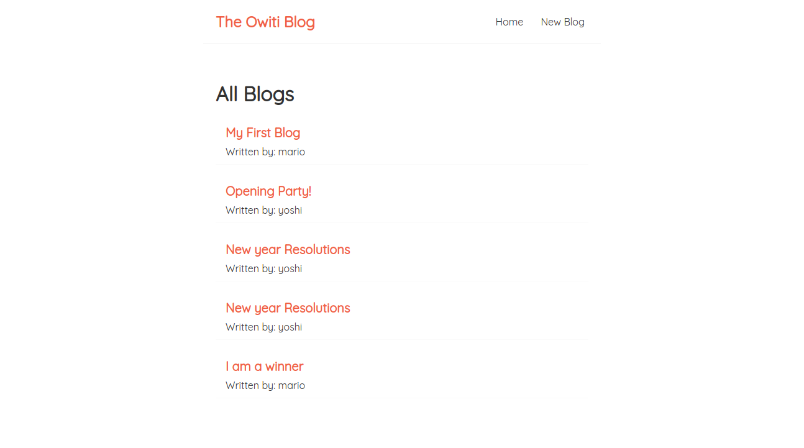
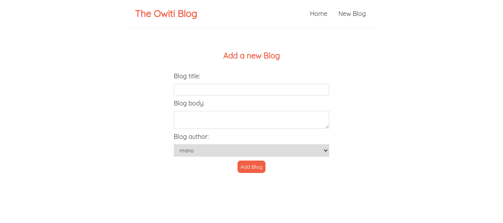
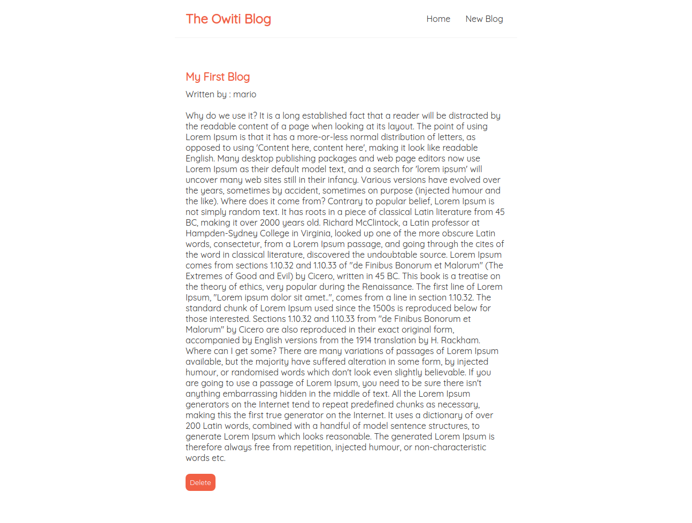

# React Blog Project
* A CRUD app that allows writing, deleting and reading of blog posts.
* The project implements a local database `data/db.json` from which data is fetched, updated and deleted.
* The `useState` hook is used to manage state.
* the `useEffect` hook is used to fetch data from the database for manipulation by the user. This is achieved by the inbuilt `fetch`
api.

## Homepage

## Create page

## Blog instance

## The project is live [`here`](https://viowiti.github.io/react-blog-app)